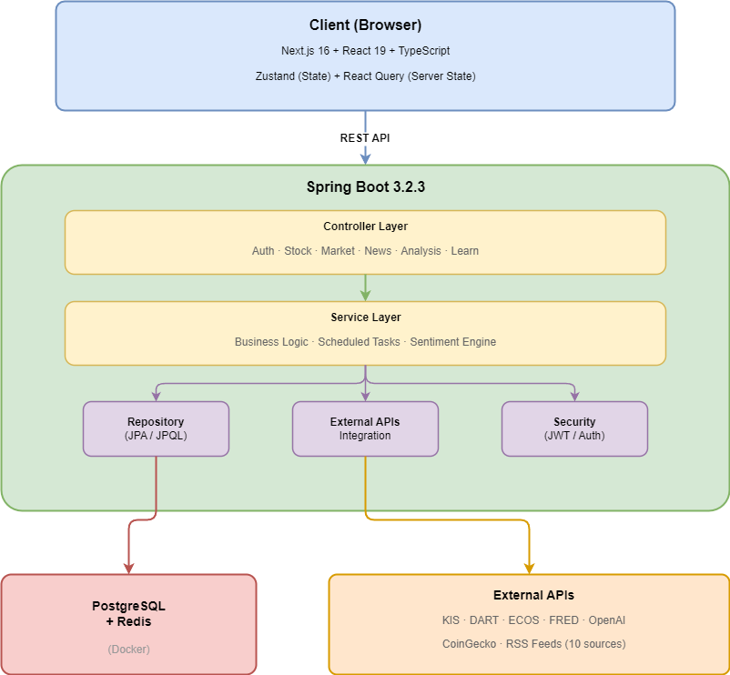
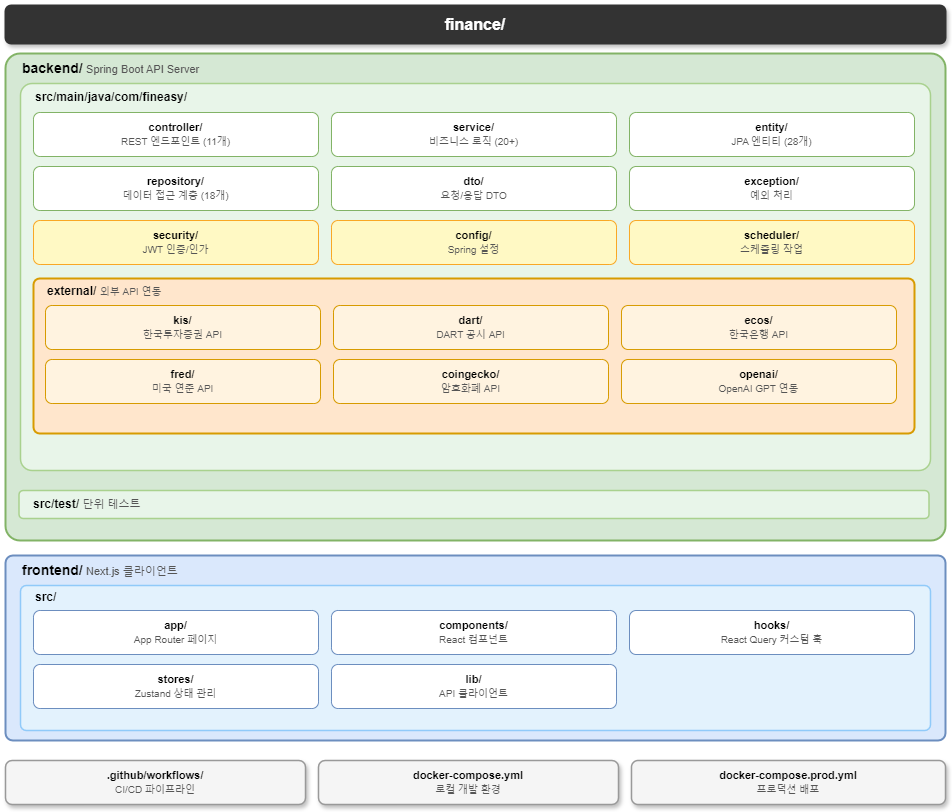
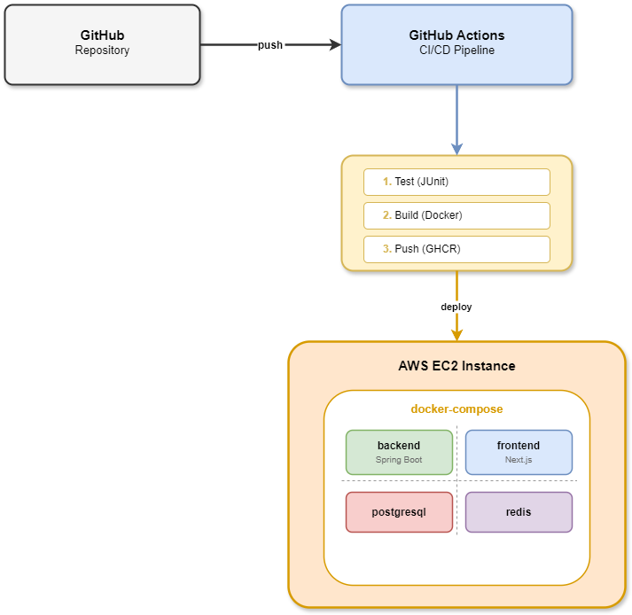
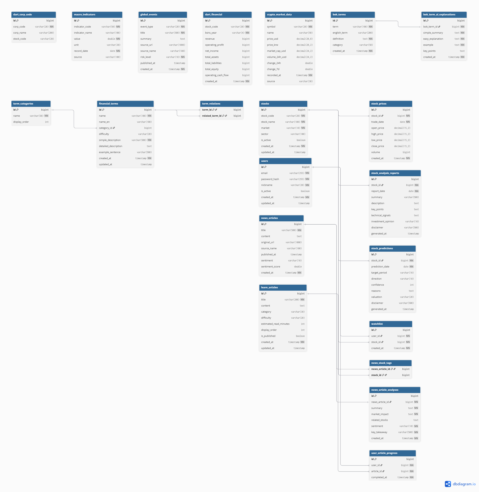

# FinEasy - 금융 정보 통합 플랫폼

> 실시간 주식 데이터, AI 기반 뉴스 감성 분석, 기업 재무제표 분석을 하나의 플랫폼에서 제공하는 풀스택 핀테크 서비스


---

## 프로젝트 소개

### 왜 만들었는가

금융 초보자가 주식 투자를 시작할 때 겪는 **정보 파편화 문제**를 해결하고자 했습니다.

- 주가 확인은 A 앱, 재무제표는 B 사이트, 뉴스는 C 포털 — 정보가 흩어져 있음
- 뉴스가 호재인지 악재인지 판단하기 어려움
- PER, PBR 같은 용어의 진입 장벽이 높음

**FinEasy**는 이 문제를 해결하기 위해 실시간 주가, 재무 분석, AI 뉴스 감성 분석, 금융 용어 학습을 **하나의 플랫폼**으로 통합했습니다.

### 핵심 기능

| 기능 | 설명 |
|------|------|
| **실시간 주가 조회** | 국내(KRX/KOSDAQ) + 해외(NASDAQ/NYSE) 주식 데이터 통합 |
| **AI 뉴스 감성 분석** | 10개 RSS 소스에서 수집한 뉴스를 GPT-4로 호재/악재 자동 분류 |
| **기업 재무 분석** | DART 공시 기반 재무제표 + ROE, 부채비율 등 파생 지표 자동 계산 |
| **거시경제 지표** | 한국은행(ECOS), 미국 연준(FRED) 데이터 통합 |
| **AI 종목 분석** | GPT 기반 종목별 분석 리포트 및 가격 예측 |
| **금융 학습 모듈** | 700+ 금융 용어 사전, 난이도별 학습 콘텐츠, 학습 진도 추적 |
| **관심종목 관리** | JWT 인증 기반 사용자별 워치리스트 |
| **암호화폐 시세** | CoinGecko API 연동 실시간 크립토 데이터 |

---

## 시스템 아키텍처



---

## 기술적 의사결정

### 1. 외부 API 장애 대응 — Circuit Breaker + Fallback 전략

**문제:** 6개 이상의 외부 API에 의존하므로, 하나라도 장애가 나면 전체 서비스가 마비될 위험

**해결:**
```
[OpenAI API 호출] → 실패 시 → [Circuit Breaker 차단] → [키워드 기반 Fallback 분석]
                                 (50% 실패율 임계치)     (GPT 없이도 감성 분석 가능)
```

- **Resilience4j Circuit Breaker**: 실패율 50% 초과 시 30초간 차단, 외부 API 부하 전파 차단
- **Retry with Exponential Backoff**: 최대 2회 재시도로 일시적 장애 대응
- **Keyword Fallback**: OpenAI 장애 시에도 700개 키워드 사전 기반 감성 분석 유지
- **Fault Isolation**: 개별 API 실패 시 null 반환으로 다른 기능에 영향 없음

### 2. 인증 시스템 — JWT Access + Refresh Token

**문제:** 세션 기반 인증은 서버 확장 시 세션 동기화 문제 발생

**해결:**
- **Access Token** (1시간): 짧은 만료로 탈취 위험 최소화
- **Refresh Token** (30일): UX 유지를 위한 자동 갱신
- **BCrypt 해싱**: 패스워드 단방향 암호화
- **Rate Limiting Filter**: 브루트포스 공격 방어

### 3. 분산 스케줄링 — ShedLock

**문제:** 다중 인스턴스 배포 시 뉴스 수집 스케줄러가 중복 실행

**해결:** ShedLock으로 분산 락 적용, 단일 인스턴스만 스케줄 작업 실행

### 4. KIS API 토큰 관리 — 자동 갱신 메커니즘

**문제:** KIS OAuth2 토큰은 24시간 만료, 수동 갱신 불가

**해결:** `KisTokenManager`가 토큰 만료 시점을 추적하고 자동으로 재발급하여 무중단 데이터 수급

---

## 프로젝트 구조



---

## API 설계

### 인증 API
| Method | Endpoint | Description | Auth |
|--------|----------|-------------|------|
| POST | `/api/v1/auth/signup` | 회원가입 | - |
| POST | `/api/v1/auth/login` | 로그인 (JWT 발급) | - |
| POST | `/api/v1/auth/refresh` | 토큰 갱신 | - |

### 주식 API
| Method | Endpoint | Description | Auth |
|--------|----------|-------------|------|
| GET | `/api/v1/stocks/search?q={query}` | 종목 검색 | - |
| GET | `/api/v1/stocks/popular` | 인기 종목 | - |
| GET | `/api/v1/stocks/{code}/price` | 현재가 조회 | - |
| GET | `/api/v1/stocks/{code}/chart` | 차트 데이터 (OHLCV) | - |
| GET | `/api/v1/stocks/{code}/financials` | 재무 지표 | - |
| GET | `/api/v1/stocks/{code}/fundamentals` | DART 재무제표 | - |
| GET | `/api/v1/stocks/{code}/sector-comparison` | 동종업계 비교 | - |

### 분석 API
| Method | Endpoint | Description | Auth |
|--------|----------|-------------|------|
| GET | `/api/v1/analysis/report/{code}` | AI 종목 분석 리포트 | - |
| GET | `/api/v1/analysis/prediction/{code}` | AI 가격 예측 | - |
| GET | `/api/v1/news` | 뉴스 피드 (감성 분석 포함) | - |

### 사용자 API
| Method | Endpoint | Description | Auth |
|--------|----------|-------------|------|
| GET | `/api/v1/watchlist` | 관심종목 조회 | JWT |
| POST | `/api/v1/watchlist/{code}` | 관심종목 추가 | JWT |
| DELETE | `/api/v1/watchlist/{code}` | 관심종목 삭제 | JWT |

### 시장/매크로 API
| Method | Endpoint | Description | Auth |
|--------|----------|-------------|------|
| GET | `/api/v1/market/summary` | 시장 개요 | - |
| GET | `/api/v1/market/risk` | 시장 리스크 평가 | - |
| GET | `/api/v1/macro` | 거시경제 지표 | - |
| GET | `/api/v1/crypto` | 암호화폐 시세 | - |

---

## 적용 기술 및 설계 패턴

### Backend

| 영역 | 기술/패턴 | 적용 이유 |
|------|----------|----------|
| **Framework** | Spring Boot 3.2.3, Java 17 | 안정적인 엔터프라이즈 프레임워크, LTS 버전 |
| **ORM** | Spring Data JPA + Hibernate | 타입 안전한 데이터 접근, JPQL 활용 |
| **인증** | Spring Security + JWT (JJWT 0.12.5) | 무상태 인증, 수평 확장 용이 |
| **외부 API 호출** | WebClient (비동기) | Non-blocking I/O로 외부 API 호출 성능 최적화 |
| **장애 대응** | Resilience4j (Circuit Breaker + Retry) | 외부 API 장애 전파 차단 |
| **분산 스케줄링** | ShedLock | 다중 인스턴스 환경에서 스케줄 작업 중복 방지 |
| **API 문서화** | SpringDoc OpenAPI 3.0 (Swagger) | 자동 API 문서 생성 |
| **캐싱** | Redis 7 | 빈번한 조회 데이터 캐싱으로 응답 속도 개선 |
| **데이터베이스** | PostgreSQL 16 | JSONB, Full-text Search 등 고급 기능 활용 |
| **테스트** | JUnit 5 + Mockito | 계층별 단위 테스트, Mock 기반 격리 테스트 |

### 설계 패턴

| 패턴 | 적용 위치 | 효과 |
|------|----------|------|
| **Strategy** | `StockDataProvider`, `AiAnalysisProvider` | Mock/Real 구현체 교체로 테스트 용이성 확보 |
| **Adapter** | `KisMarketDataAdapter` | 외부 API 응답을 도메인 모델로 변환, 결합도 감소 |
| **Circuit Breaker** | OpenAI, KIS API 호출부 | 장애 격리 및 자동 복구 |
| **Scheduled Observer** | 뉴스 수집, 주가 동기화 | 주기적 데이터 갱신 자동화 |
| **DTO Pattern** | 전 계층 간 데이터 전달 | 엔티티 노출 방지, API 스펙 안정성 확보 |

### Frontend (AI 활용 구현)

> 프론트엔드는 백엔드 API의 동작을 시각적으로 확인하기 위한 클라이언트로, AI 도구를 활용하여 구현했습니다.

| 기술 | 역할 |
|------|------|
| Next.js 16 (App Router) | SSR/SSG 하이브리드 렌더링 |
| TypeScript | 타입 안전성 |
| Zustand | 클라이언트 상태 관리 |
| TanStack React Query | 서버 상태 캐싱 및 동기화 |
| Tailwind CSS + shadcn/ui | UI 컴포넌트 |
| lightweight-charts | 캔들스틱 차트 |

---

## 인프라 및 배포


- **CI/CD**: GitHub Actions (테스트 → 빌드 → GHCR 푸시 → EC2 SSH 배포)
- **컨테이너**: Docker 멀티스테이지 빌드 (빌드 이미지와 런타임 이미지 분리)
- **모니터링**: Spring Actuator (`/actuator/health`, `/actuator/info`)

---

## 실행 방법

### 사전 요구사항
- Java 17+
- Node.js 18+
- Docker & Docker Compose

### 로컬 개발 환경

```bash
# 1. 저장소 클론
git clone https://github.com/your-username/finance.git
cd finance

# 2. 환경 변수 설정
cp .env.example .env
# .env 파일에 API 키 설정 (KIS, DART, OpenAI 등)

# 3. Docker Compose로 전체 실행
docker-compose up -d

# 4. 접속
# Backend API:  http://localhost:8080
# Frontend:     http://localhost:3000
# Swagger UI:   http://localhost:8080/swagger-ui.html
```

### 백엔드만 실행

```bash
cd backend
./gradlew bootRun --args='--spring.profiles.active=dev'
```

### 프론트엔드만 실행

```bash
cd frontend
npm install
npm run dev
```

---

## ERD (Entity Relationship Diagram)



> 전체 28개 엔티티, 18개 Repository

---

## 프로젝트 규모

| 항목 | 수치 |
|------|------|
| Backend Java 소스 파일 | 177개 |
| REST API 엔드포인트 | 50+ |
| JPA 엔티티 | 28개 |
| Repository | 18개 |
| Service | 20+ |
| Controller | 11개 |
| 외부 API 연동 | 6개 (KIS, DART, ECOS, FRED, CoinGecko, OpenAI) |
| RSS 뉴스 소스 | 10개 |
| Frontend 컴포넌트 | 30+ |
| 금융 용어 사전 | 700+ 항목 |

---

## 트러블슈팅 경험

### 1. KIS API Rate Limit 이슈
- **상황**: 실시간 주가 조회 시 KIS API 호출 한도 초과
- **해결**: Redis 캐싱 도입으로 동일 종목 조회 시 캐시 우선 반환, API 호출 횟수 대폭 감소

### 2. 뉴스 감성 분석 정확도 저하
- **상황**: GPT API 장애 시 감성 분석 불가, 서비스 핵심 기능 마비
- **해결**: 키워드 기반 Fallback 분석기 구현 (700개 긍정/부정 키워드 사전), Circuit Breaker로 장애 격리

### 3. 스케줄러 중복 실행
- **상황**: 서버 다중 인스턴스 배포 시 뉴스 수집 스케줄러가 인스턴스별로 중복 실행
- **해결**: ShedLock 적용으로 분산 락 구현, 단일 인스턴스만 작업 수행 보장

---

## 기술 스택 요약

```
Backend:   Java 17 · Spring Boot 3.2 · Spring Security · JPA · JWT
Database:  PostgreSQL 16 · Redis 7
Infra:     Docker · GitHub Actions · AWS EC2 · GHCR
Frontend:  Next.js 16 · React 19 · TypeScript · Tailwind · Zustand
External:  KIS API · DART · ECOS · FRED · OpenAI · CoinGecko
```

---

<p align="center">
  <sub>Built with Spring Boot & Next.js</sub>
</p>
